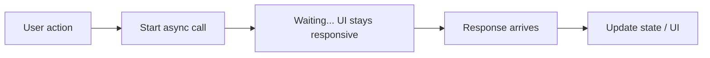

# Diagram: Async flow

This shows what happens when the user triggers something that loads data **asynchronously**.

**In words:** Tap → start request → app can still animate and scroll → data arrives → `setState` or Provider → new UI.
