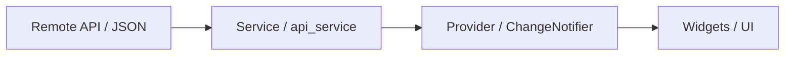

# Diagram: Data flow (API → UI)

Typical layers for a small app using Provider:

- **Service** — `http.get`, parse JSON, maybe map errors.
- **Provider** — holds lists, loading flags, error messages; calls `notifyListeners()`.
- **UI** — `watch`es the provider and shows lists, spinners, or error text.
