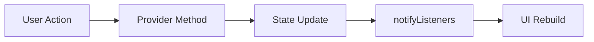

# Diagram: Provider state flow

Simple example:

- User taps **Refresh**
- `TodoProvider.fetchTodos()` runs
- `loading`, `todos`, or `error` changes
- `notifyListeners()` is called
- UI updates automatically
