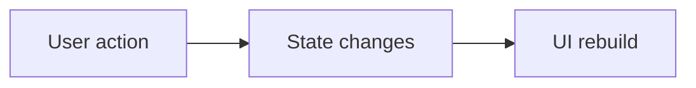

# Diagram: State flow (user → UI)

**Example:** User taps “Refresh” → provider clears list, sets `loading = true`, fetches API → sets todos + `loading = false` → `notifyListeners()` → widgets that `watch` the provider **rebuild** and show the new list.
