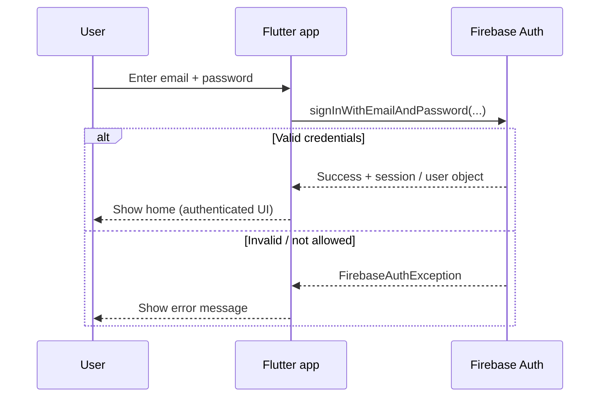
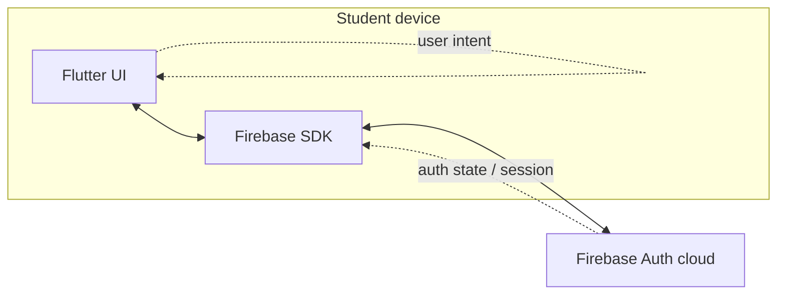

# Authentication Flow Explained (Concepts — No Full Code)

This document is for **understanding**, not copy-paste. It supports the Week 4 lecture on **Firebase Authentication** in Flutter.

## Simple real-world analogy: conference badge

Imagine a **conference**:

1. You **register** once (Firebase stores your account).
2. At the door you **show ID**; staff checks the list and gives you a **badge**.
3. While you wear the badge, staff **recognizes you** without asking for your password again every minute.
4. When you **leave**, you **return the badge**—you are anonymous again to that venue.

- **Login** ≈ showing ID and receiving a badge.
- **Token** (below) ≈ the badge the app uses to prove the session is still valid.
- **Logout** ≈ returning the badge.

## Login flow: User → App → Firebase → Token → App

At a high level:

After a successful sign-in, the **Firebase SDK** maintains a **session**. Your app listens to **auth state** (e.g. `authStateChanges`) so the UI stays in sync when the user signs out or the session ends.

## What is a token? (simple)

A **token** is a short-lived **proof** issued by Firebase that means: *“This device recently authenticated as user X.”* Your app does not need to implement token parsing in Week 4—the **SDK handles refresh and storage** on each platform.

- **Why it matters**: APIs and security rules (e.g. Firestore later) can trust **who** is calling without you sending the password again.
- **What students should remember**: Tokens are **not** passwords; they **expire** and get **refreshed** by the SDK.

## Auth state: login and logout

```mermaid
stateDiagram-v2
    [*] --> LoggedOut
    LoggedOut --> LoggedIn: sign in success
    LoggedIn --> LoggedOut: sign out / session cleared
    LoggedIn --> LoggedOut: invalid session (rare; SDK updates stream)
```

In Flutter, a **stream** of `User?` lets you **rebuild** the widget tree when the state moves between **LoggedOut** and **LoggedIn**—for example with `StreamBuilder` in the lecture.

## Firebase Auth vs “real-world” systems

| Aspect | Firebase Authentication | Typical enterprise (e.g. OAuth + FusionAuth / OIDC) |
|--------|-------------------------|-----------------------------------------------------|
| **Who runs the server?** | Google-managed | Often **your team** or a vendor **hosts** the auth server |
| **Protocols** | SDK abstracts many details | Often explicit **OAuth2 / OpenID Connect** flows |
| **User store** | Firebase project | Your chosen **identity provider** or self-hosted DB |
| **Best for** | Teaching, MVPs, mobile-first apps with Google ecosystem | Custom SSO, strict compliance, multi-tenant enterprise |

**OAuth** (often used with Google / Microsoft / GitHub sign-in) is a **standard way** to delegate login to another provider. Firebase can integrate with several providers; this course starts with **email/password** for clarity.

**FusionAuth** (and similar products) are **self-hostable or vendor-hosted** auth servers: teams get **full control** and branding, at the cost of more **operations** and integration work than Firebase’s hosted Auth.

None of this changes your Week 4 homework pattern: **initialize Firebase**, **sign in**, **listen to auth state**, **sign out**.

## Diagram: where Flutter sits

## Takeaway

- **Login** proves identity to Firebase.
- **Session / token** is maintained by the SDK after that.
- **Auth state handling** keeps your **screens** aligned with **reality** (signed in or not).

Return to the step-by-step guides (`01`–`06`) for **what to do in the IDE** during the week.
