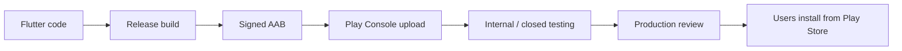

# Week 7 — Introduction: From Code to the Play Store

You have built Flutter apps on your machine. **Publishing** means delivering a **signed, versioned binary** to Google so users can install it from the **Play Store** (or from a testing track you control).

## Two different “apps”

| Concept | Example | Where it lives |
|---------|---------|----------------|
| **Dart package name** | `tap_rush_game` | `pubspec.yaml` → `name:` |
| **Android application ID** | `com.icet.student.tap_rush_game` | `android/app/build.gradle.kts` → `applicationId` |

The **Play Store cares about application ID**. It must be **unique worldwide** and **stable** — you cannot change it after upload without creating a new listing.

## Build types you will use

| Build | Command idea | Signed with | Use |
|-------|----------------|-------------|-----|
| **Debug** | `flutter run` | Debug key (auto) | Daily development |
| **Release** | `flutter build appbundle` | **Your upload keystore** | Store upload |
| **Profile** | `flutter run --profile` | Debug-like | Performance profiling |

## APK vs App Bundle (AAB)

| Format | Play Store | Notes |
|--------|------------|--------|
| **APK** | Legacy / side-load | One file per device type; larger. |
| **AAB** | **Required for new apps** | Google generates optimized APKs per device. |

**This course standard:** upload **`app-release.aab`** built with:

```bash
flutter build appbundle --release
```

You may also build an APK for **local testing**:

```bash
flutter build apk --release
```

## End-to-end pipeline (big picture)



## What we use in class

| Project | Purpose |
|---------|---------|
| **`tap_rush_game`** | Small game — fast to brand, sign, and upload |
| **`task_manager_app`** | Optional — same steps when your Firebase app is ready |

## What is out of scope this week

- iOS App Store submission
- Backend servers, billing, ads setup
- Play App Signing advanced migration (mentioned, not lab-required)

## Next

**02-app-identity-and-versioning.md** — set ID, version, and display name before building.
