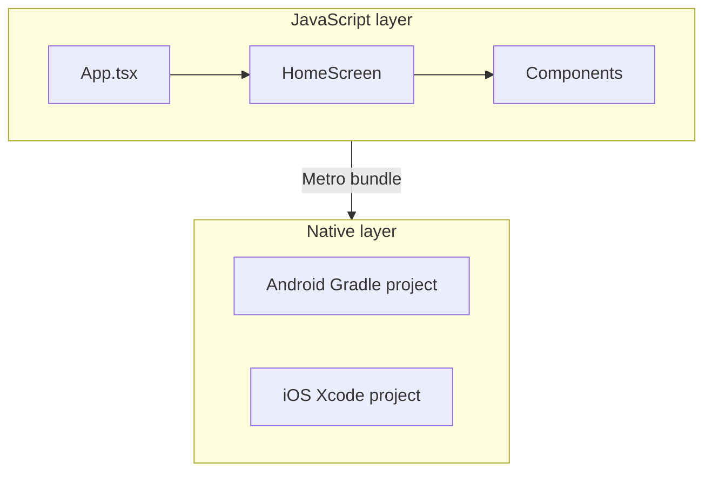

# Week 8 — Introduction: React Native after Flutter

You have built mobile UIs with **Flutter** (Dart → Skia/Impeller). **React Native** is another way to build **iOS and Android** apps: you write **JavaScript or TypeScript**, and React Native renders **native** widgets (`View`, `Text`, etc.) on each platform.

## One sentence each

| | Flutter | React Native |
|---|---------|----------------|
| **Language** | Dart | JavaScript / TypeScript |
| **UI model** | Widget tree | Component tree (JSX) |
| **Entry** | `main()` → `runApp()` | `index.js` → `AppRegistry` → `App.tsx` |
| **Hot reload** | Flutter hot reload | Fast Refresh (Metro) |
| **Package file** | `pubspec.yaml` | `package.json` |

Both are **cross-platform**. Neither replaces learning the other in industry — many teams use one or both.

## What you will build this week

A single-screen app **`react_native_intro`** that shows:

- A **header component** (`WelcomeHeader`)
- **Info cards** (`LessonCard`)
- A **button** (`PrimaryButton`)
- A **counter** using **`useState`** (`CounterDemo`)

This is intentionally small so you can finish in **~3 hours**.

## Mental model

- You edit **`.tsx` files** in `src/`.
- **Metro** bundles JavaScript for the device/emulator.
- **`android/`** and **`ios/`** are native shells (like Flutter’s `android/` / `ios/` folders).

## What is out of scope this week

- Publishing to stores (you did Android publishing in Week 7 with Flutter)
- Navigation stacks (React Navigation)
- Redux / global state libraries
- Calling your Task Manager API from RN

## Next

**02-environment-setup.md** — install Node, run the app once.
